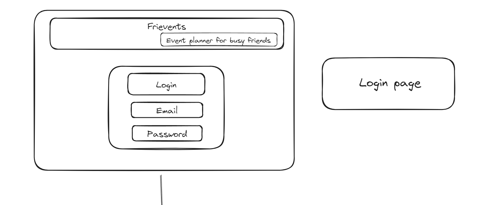
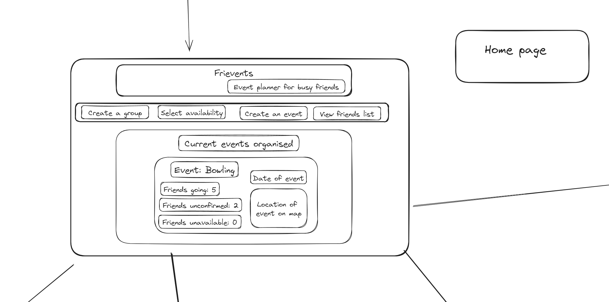
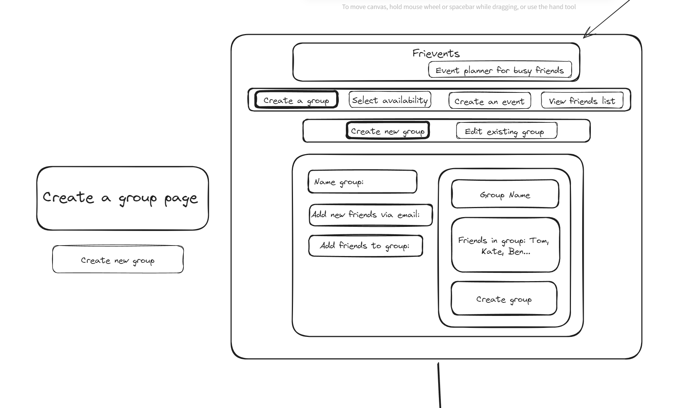
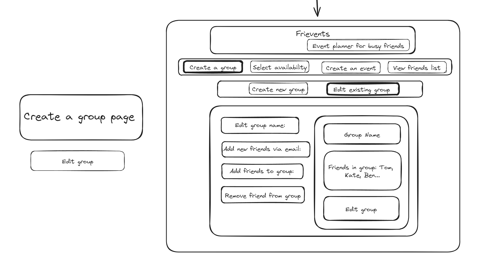
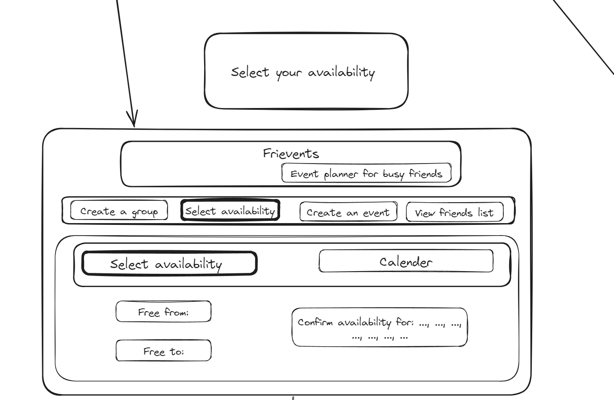
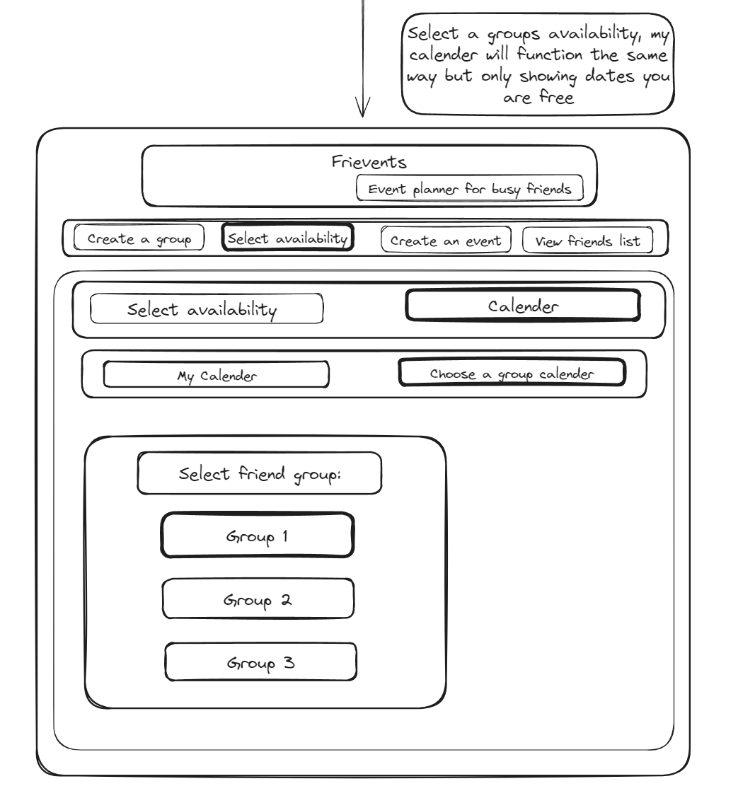
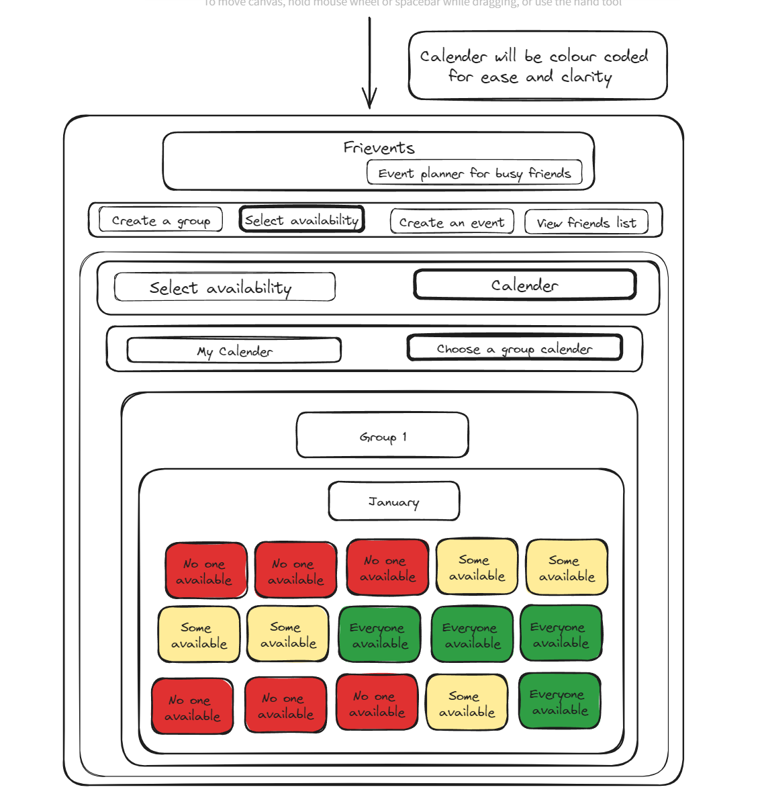
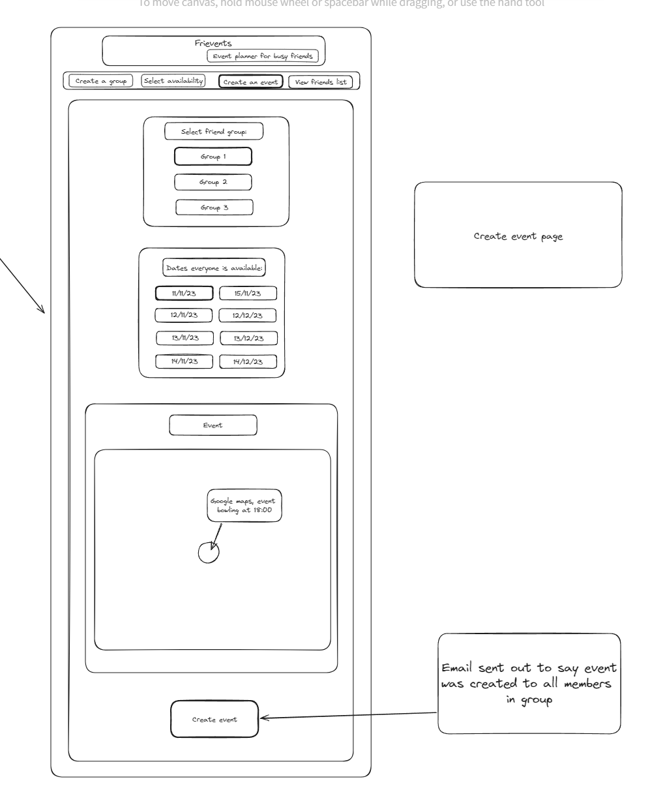
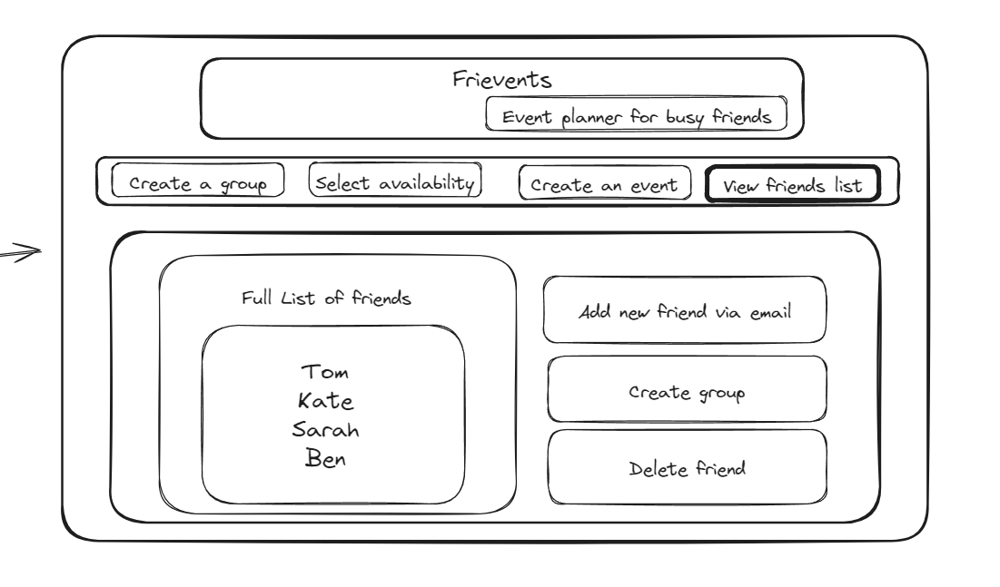
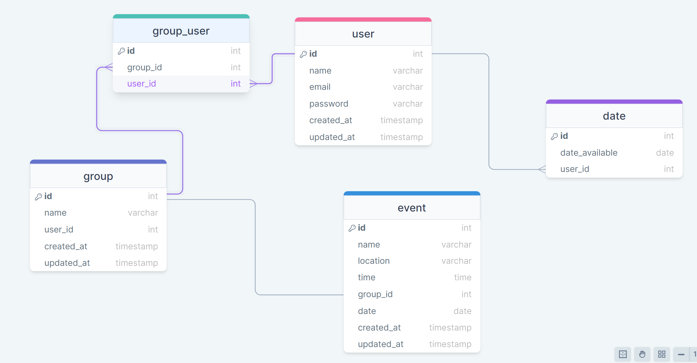

# Project Title

## Overview

My app is an event planner for groups. Initially planning for private groups with friends and as an extension public events for anyone in the local area to attend. For private events with friend groups you will need to input the dates you are free and you will be able to suggest events you wish to organise, the location and date and view all your friends available dates as well.

### Problem

Why is your app needed? Background information around any pain points or other reasons.

Planning events in a group is always very difficult and harder than it should be as adults because everyone has busy lives. So this will make the planning process easier for everyone.

### User Profile

Who will use your app? How will they use it? Any special considerations that your app must take into account.

Anyone with friends who wishes to organise plans in a simple, seamless way. Suggest an event, suggest a date, time and location. View their friends availability so easier to plan. Notification sent out to all their friends about the creation of the event and the option for all of their friends to agree to attend, rearrange the event for a different day and suggest a better day or decline the event invitation. Notification if the friend changes their availibity so they are no longer able to attend the event.

### Features

List the functionality that your app will include. These can be written as user stories or descriptions with related details. Do not describe _how_ these features are implemented, only _what_ needs to be implemented.

- Email notification pop ups to other users
- Log in feature
- Calender to see everyone's availability (red for when no one is available, orange for a few people are available, green or dark green is for when everyone is free.)
- Ability to suggest new date for event, or new activity for event on the same day and then email is resent out to everyone with the option to vote for whichever one they would most prefer to do.
- Email notification to say there has been an update in the app and then they should re-sign into app

## Implementation

### Tech Stack

List technologies that will be used in your app, including any libraries to save time or provide more functionality. Be sure to research any potential limitations.

- React
- MySQL
- Express
- Client libraries:
  - react
  - react-router
  - axios
- Server libraries:
  - knex
  - express
    -nodemailer (backend library to send email notifications to users) (only gmail)

### APIs

List any external sources of data that will be used in your app.

- No external APIs will be used

### Sitemap

List the pages of your app with brief descriptions. You can show this visually, or write it out.

- Login page
- Home page
- Create a group page
  - Create new group
  - Edit existing group
- Select availability page
  - Select availability
  - Calender
    - My calender
    - Choose a group calender
- Create an event page
- View friends list page

### Mockups

Provide visuals of your app's screens. You can use tools like Figma or pictures of hand-drawn sketches.

### Login Page

### Home Page

### Create group page

### Edit group page

### Select availability page

### Choose a group calender page

### Calender Page

### Create an event page

### friend list page

### Data

Describe your data and the relationships between them. You can show this visually using diagrams, or write it out.

### Endpoints

List endpoints that your server will implement, including HTTP methods, parameters, and example responses.

**GET /users**

- Get all user

**GET /users/:id**

- Get one user

**POST /users**

- Add a new user

**PATCH /users**

- edit a user

**GET /dates**

- Get all dates

**POST /dates**

- Add a new date

**Delete /dates**

- Delete a date

**GET /event**

- Get all event details including group details and users attending

**POST /event**

- Create an event with a group and a list of users

**PATCH /event**

- Edit event

**GET /group**

- Get one group with list of all users in group

**POST /group**

- Create group with a list of users for that group

**PATCH /group**

- Edit who is in the group

### Auth

Does your project include any login or user profile functionality? If so, describe how authentication/authorization will be implemented.

- I would like to implement authorization if possible

## Roadmap

Scope your project as a sprint. Break down the tasks that will need to be completed and map out timeframes for implementation. Think about what you can reasonably complete before the due date. The more detail you provide, the easier it will be to build.

- Create and set up server such as installing libraries

- Create and set up client such as installing libraries and cleaning up code ready for use

- Create routes and make endpoints on the backend with validation

- Test backend with postman to see if endpoints are working

- Start building out front end with routes to see if pages are working

- Design front end to look like mockup

- Pull data from backend and layout data on the frontend to structure pages

- Add validation to the frontend

## Nice-to-haves

Your project will be marked based on what you committed to in the above document. Under nice-to-haves, you can list any additional features you may complete if you have extra time, or after finishing.

- Add a map to allow users to see where the event will be held.

- Allow for public events so users can see public events in the local area

- Add animations to webpage (mui) (materialui) (nextui)
